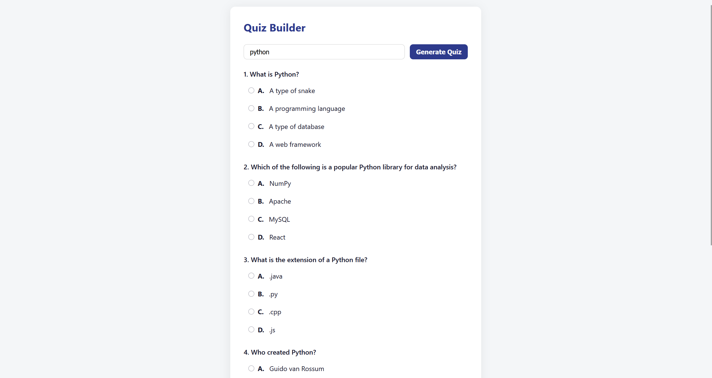
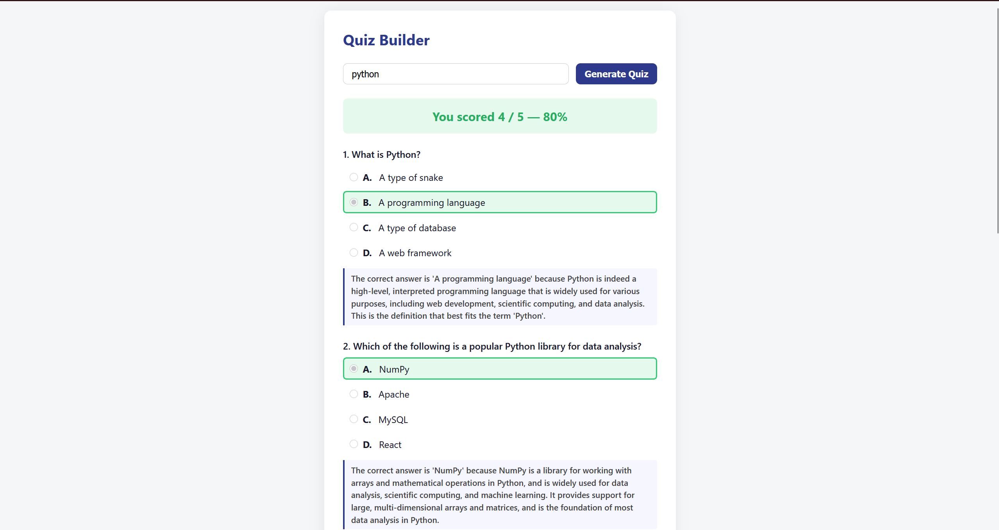

# Quiz Builder

## Description

An AI-powered quiz generator. Give it a topic, it generates 5 multiple-choice questions, scores your answers and explains why each correct answer is right.

<sub>Built for Entrata's take-home assignment: 5 multiple-choice questions per quiz, 4 options each, score and correct answers shown after submission. All three bonus features are implemented: Wikipedia-based retrieval for factual grounding, persistence for reviewing past quizzes, and per-question explanations after scoring.</sub>

## Screenshots

**Topic input**


**Generated quiz**



**Scored results with explanations**



**Quiz history**


## Quick start

```bash
# Backend
cd backend
pip install -r requirements.txt
# add GROQ_API_KEY to a .env file in backend/
uvicorn main:app --reload

# Frontend
open frontend/index.html
```

## API

| Endpoint | Purpose |
|---|---|
| `POST /generate-quiz` | Fetch Wikipedia context, generate 5 questions, save to SQLite, return a `quiz_id` |
| `POST /score` | Look up the answer key by `quiz_id`, score submitted answers, generate explanations in one call, save the attempt |
| `GET /topics` | Suggested topics for the frontend's autocomplete |
| `GET /history` | List past quizzes with their most recent score |

`main.py` only handles routing and HTTP errors. All the actual logic is in `quiz_generator.py` and `db.py`.

The frontend is one HTML file and one JS file. Four states: enter a topic, answer the quiz, see results, view history.

---

## Why Groq + Llama 3.3

This workload is bursty and doesn't need frontier-model reasoning — generating MCQs is a moderate difficulty task. Groq's free tier covers it, which matters for an MVP with no production traffic yet.

The provider call is isolated to two functions in `quiz_generator.py`, so switching to Claude or GPT later is a small change.

Groq doesn't offer a strict JSON guarantee, so reliability comes from prompting instead: explicit format instructions, a worked example, and a retry if the response fails to parse.

---

## Wikipedia grounding

Before generating questions, `fetch_wikipedia_summary(topic)` hits: 
GET https://en.wikipedia.org/api/rest_v1/page/summary/{topic}


If found, the summary gets sent to the prompt as factual grounding. If not, generation proceeds without it.

This helps for stable, well-documented topics and does nothing for niche topics — at that point the model is relying on its own training knowledge.

---

## Handling unreliable JSON output

LLMs occasionally ignore formatting instructions: wrapping output in markdown fences, adding stray text, or truncating. The generation and explanation calls both go through `_parse_json_with_retry`:

1. Strip markdown code fences if present
2. Try `json.loads()`
3. If that fails, replay the conversation with the model's bad response included, plus a correction message, and try once more
4. If the retry also fails, raise a clear error instead of crashing silently

One retry, enough to recover from the common case without burning API calls.

---

## Persistence — SQLite

Quiz and attempt data is stored in a local SQLite database (`backend/quiz_history.db`), created automatically on first run via `backend/db.py`.

**Schema:**
- `quizzes` — `id`, `topic`, `questions_json`, `answer_key_json`, `created_at`
- `attempts` — `id`, `quiz_id`, `answers_json`, `score`, `total`, `submitted_at`

**Flow:** `/generate-quiz` saves the new quiz and returns a `quiz_id` to the client, used as the lookup key instead of the raw topic string. `/score` looks up the answer key by `quiz_id`, scores the submission, and saves the attempt. `/history` lists past quizzes with their most recent score.

This design means two users generating a quiz on the same topic at the same time get distinct `quiz_id`s instead of colliding, and data survives a server restart since SQLite writes to disk.

SQLite (not Postgres) was chosen because it needs zero setup — no separate database server for a take-home reviewer to run. The schema and queries are simple enough that swapping to Postgres later would mean changing the connection string and one or two SQL dialect quirks, not a redesign.

---

## Two-stage generation

Explanations are only generated after a quiz is submitted, not upfront — there's no point spending tokens explaining questions a user might never finish. When they are needed, all 5 are requested in a single batched call rather than 5 separate ones, which keeps both latency and cost down.
